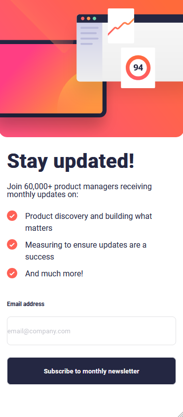

# Frontend Mentor - Newsletter sign-up form with success message solution

This is a solution to the [Newsletter sign-up form with success message challenge on Frontend Mentor](https://www.frontendmentor.io/challenges/newsletter-signup-form-with-success-message-3FC1AZbNrv). Frontend Mentor challenges help you improve your coding skills by building realistic projects.

## Table of contents

- [Overview](#overview)
  - [The challenge](#the-challenge)
  - [Screenshot](#screenshot)
  - [Links](#links)
- [My process](#my-process)
  - [Built with](#built-with)
  - [Continued development](#continued-development)
- [Author](#author)

## Overview

### The challenge

Users should be able to:

- Add their email and submit the form
- See a success message with their email after successfully submitting the form
- See form validation messages if:
  - The field is left empty
  - The email address is not formatted correctly
- View the optimal layout for the interface depending on their device's screen size
- See hover and focus states for all interactive elements on the page

### Screenshot

### Links

- Solution URL: [GitHub repo](https://github.com/ivanorsolic95/newsletter)
- Live Site URL: [Check out my solution](https://newsletter3.netlify.app/)

## My process

### Built with

- HTML5
- CSS custom properties
- Flexbox
- CSS Grid
- Mobile-first workflow
- JavaScript

### Continued development

After few challenges from Frontend Mentor, I'm still having troubles with organizing HTML. I want to read articles, books, and other materials to figure out how to follow best practices when comes to structuring of HTML.

## Author

- Website - [Ivan Orsolic](https://ivanorsolic.live/)
- Frontend Mentor - [ivanorsolic95](https://www.frontendmentor.io/profile/ivanorsolic95)
- Twitter - [orsolic_ivan1](https://x.com/orsolic_ivan1)
